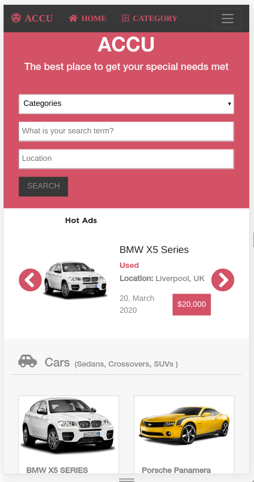
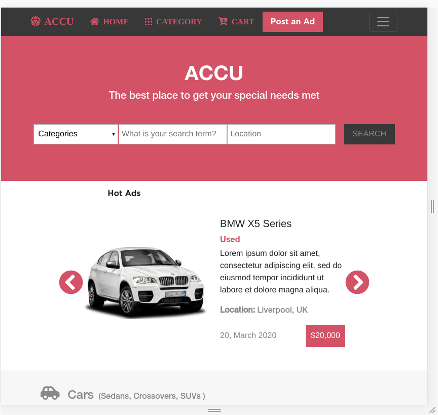
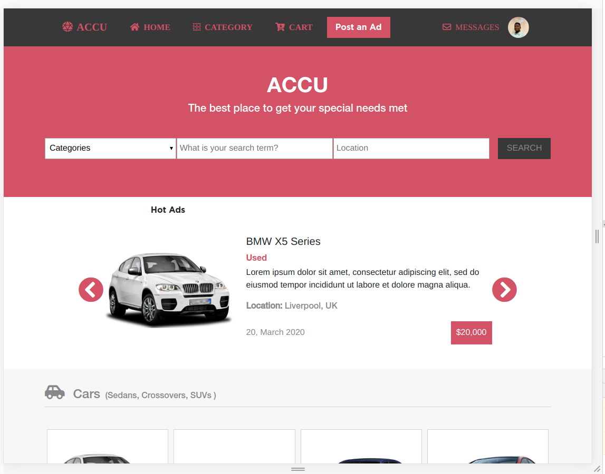
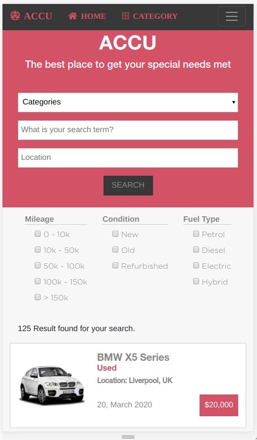
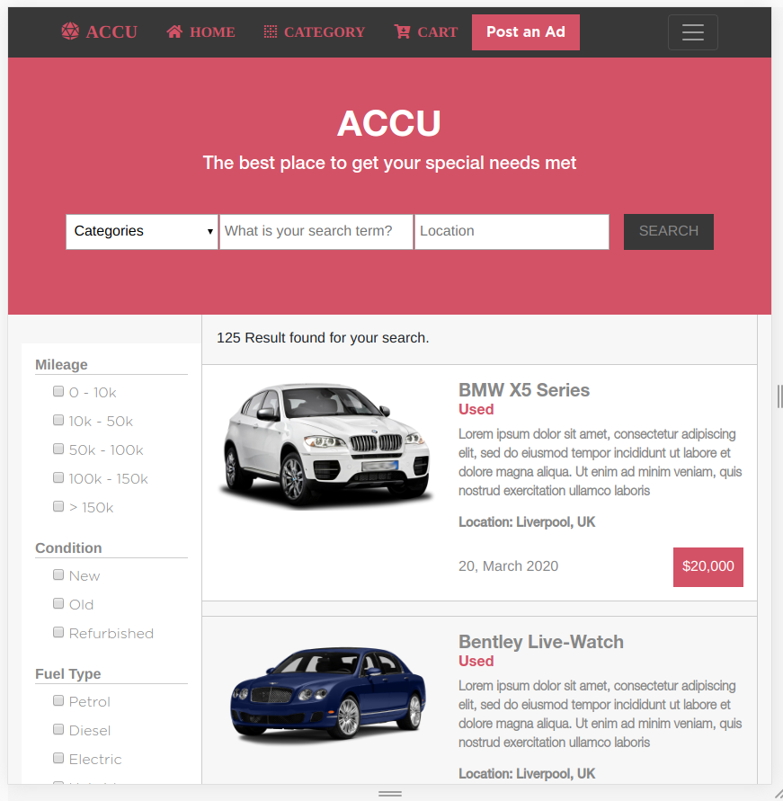
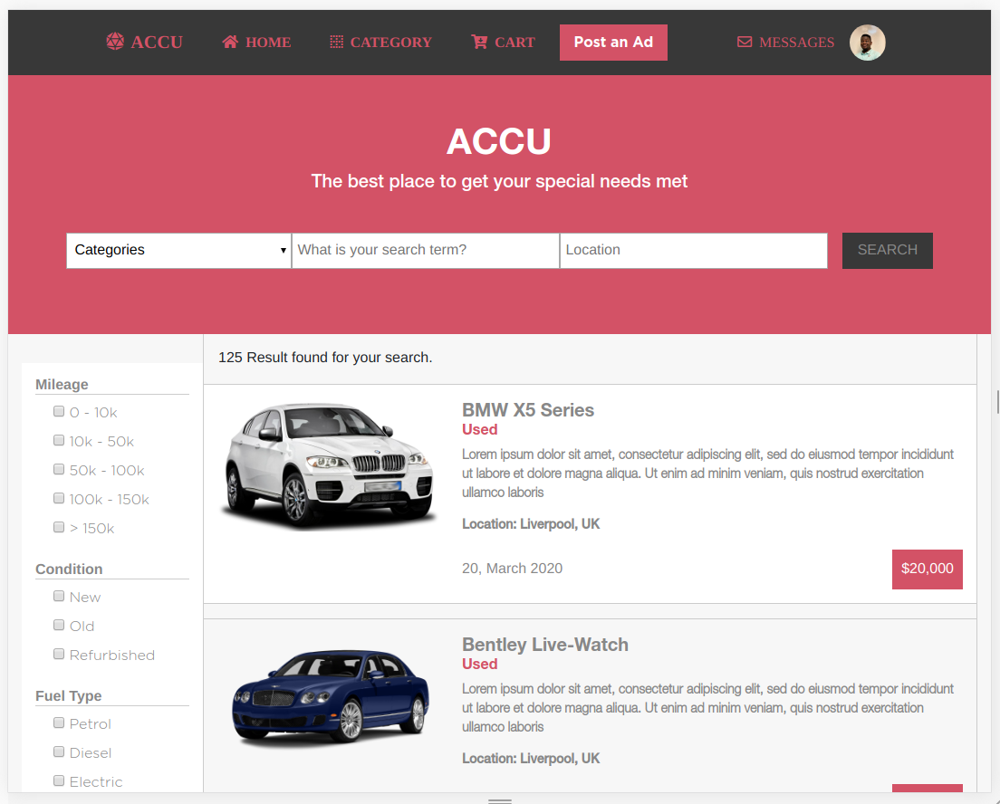

# HMTL/CSS Capstone Project -Electronics Store

> This project is to develop the Home page and Search page of an Online store using the template designed by Mohammed Awad on [Behance](https://www.behance.net/gallery/24796463/ZATTIX)

> The pages are to be designed with 2 breakpoints so the following views are expected Mobile, Tablet and Desktop

Additional description about the project and its features.

## Built With

- HTML, CSS
- Bootstrap4
- Flexbox and Grid
- Images used for this project were gotten from pngimages.com

## Live Demo

[Live Demo Link](https://raw.githack.com/AdedayoOpeyemi/Capstone-Electronic-store/feature-branch/index.html)

## Getting Started

### To get a local copy up and running follow these simple example steps.

- run the following command $git clone git@github.com:AdedayoOpeyemi/Capstone-Electronic-store.git

## Authors

👤 **Author1**

- Github: [@Adedayoopeyemi](https://github.com/Adedayoopeyemi)
- Twitter: [@oyelesiopy](https://twitter.com/oyelesiopy)
- Linkedin: [linkedin](https://linkedin.com/opeyemioyelesi)

## 🤝 Contributing

Contributions, issues and feature requests are welcome!

Feel free to check the [issues page](issues/).

## Show your support

Give a ⭐️ if you like this project!

## Acknowledgments

- Hat tip to anyone whose code was used
- Inspiration
- etc

## 📝 License

This project is [MIT](lic.url) licensed.
